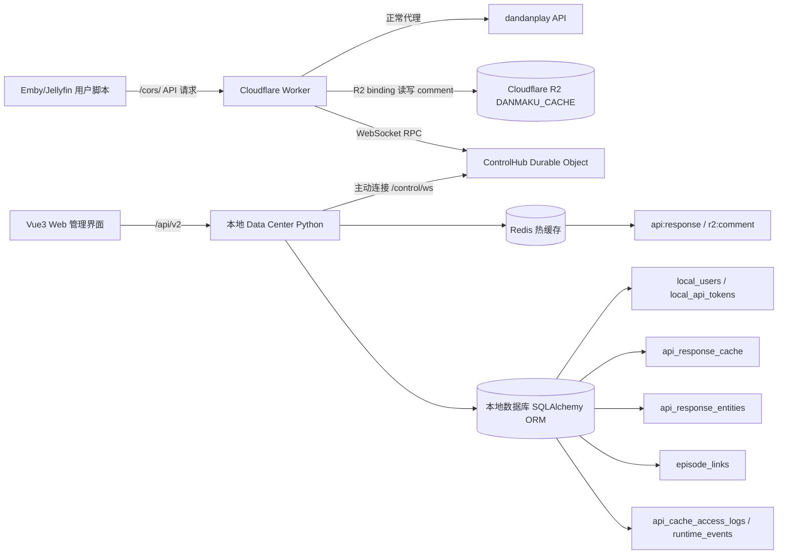
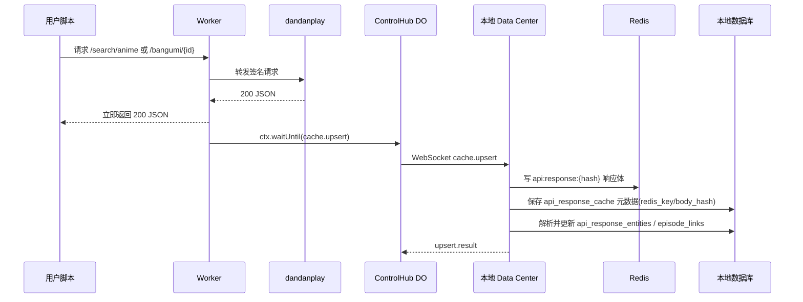
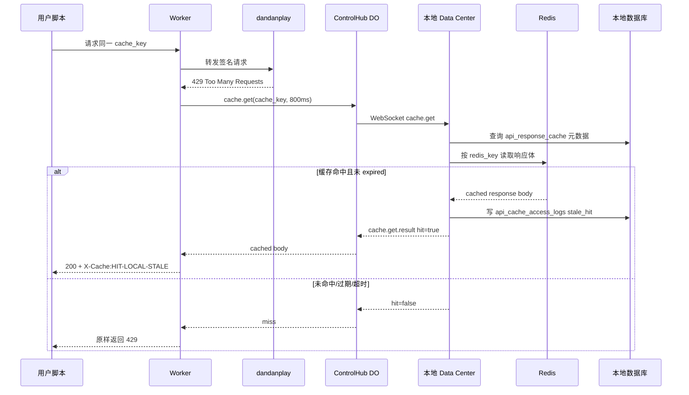
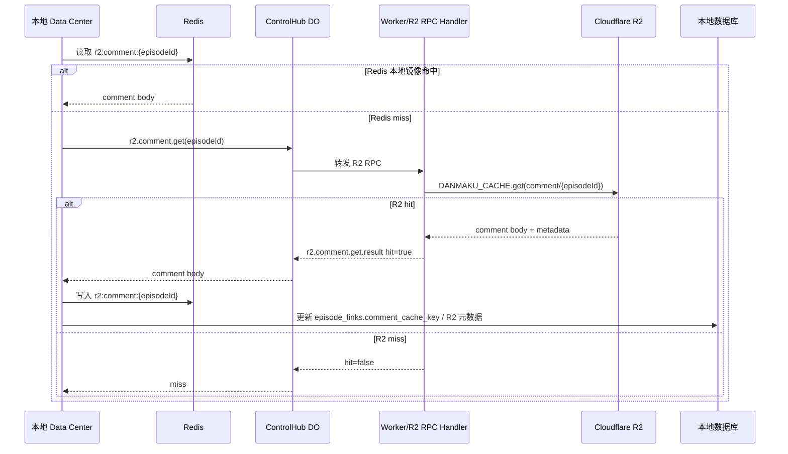

# Worker 端与本地端重构方案：长连接控制 + 本地化响应缓存

> 整理版重点：本地旧同步与旧表全部废弃；新本地端使用 Python + FastAPI + SQLAlchemy ORM；Redis 作为热缓存；Cloudflare R2 只能由 Worker/DO 读取，本地端通过 WebSocket RPC 间接读取；上游 429 时 Worker 优先查询本地缓存兜底。

## 1. 背景与目标

当前项目中，Worker 与本地 data-center 的交互主要是：

- Worker 提供 `/worker-api/config/update`、`/worker-api/stats`、`/worker-api/logs` 等接口。
- 本地端通过轮询/HTTP 请求推送配置、拉取统计与日志。
- 本地数据主要围绕配置、日志、统计，不能参与弹弹 play 上游接口降级。

新需求：

1. **完全废弃现有本地同步方式与现有同步数据结构**。
2. 新方案不仅同步日志、配置，还要记录弹弹 play 的接口响应。
3. 重点本地化以下上游接口响应：
   - `/api/v2/search/anime`
   - `/api/v2/search/episodes`
   - `/api/v2/bangumi/{animeId}`
   - `/api/v2/match`
   - 可扩展 `/api/v2/comment/{episodeId}`，但 comment 仍优先走 Worker R2。
4. 当上游接口返回 **429** 时，Worker 应尝试使用本地端缓存响应作为兜底。
5. 本地缓存不是永久死数据：当缓存达到刷新间隔后，如果有新请求命中同一资源，应在后台尝试更新本地缓存。
6. 需要一个长连接通道，用于本地端与 Worker 之间的控制、查询和回传。

---

## 2. 总体原则

- **Worker 仍是所有客户端请求入口**：Emby/Jellyfin 用户脚本仍只访问 Worker。
- **本地端作为 Worker 的外部状态与缓存中心**：Redis 负责热响应体，SQLAlchemy DB 负责元数据、实体索引、日志、配置、用户。
- **长连接由本地端主动连 Worker**：避免本地端公网暴露，也符合 NAT/家庭网络场景。
- **Worker 不强依赖本地端**：本地端离线时，Worker 仍能正常代理上游，只是失去本地降级能力。
- **429 才强制本地兜底**：正常 200 响应仍以实时上游为准，并异步写入本地缓存。
- **避免过度复杂**：先做单 Worker + 单本地端，后续再扩展多 Worker/多节点。

---

## 3. 废弃范围

以下内容作为旧架构废弃：

### Worker 端废弃

- `/worker-api/config/update`
- `/worker-api/stats`
- `/worker-api/logs`
- 旧的 `handleDataCenterAPI` 中“配置推送/统计/日志拉取”语义
- 旧 `DATA_CENTER_CONFIG` 中以 HTTP 同步为核心的字段

### 本地端废弃

- `WorkerSyncService` 中的旧推送/拉取逻辑
- 旧同步日志表与旧统计表中“拉取 Worker 状态”的数据模型
- 旧 `/worker-api/sync/*` 语义
- 现有旧数据不做迁移，允许清库重建

保留但重构：

- Web 管理界面认证体系可保留。
- UA 限流配置、IP 黑名单概念可保留，但同步方式改为长连接命令。
- Worker 内存日志可保留为本地不可用时的临时缓冲。

---

## 4. 新架构总览

```text
用户脚本 / Emby / Jellyfin
      |
      v
Cloudflare Worker  ----签名代理---->  Dandanplay API
      |
      | 429 fallback / cache.upsert / R2 RPC
      v
ControlHub Durable Object（WebSocket 长连接汇聚点）
      ^
      |
本地端 Data Center（Python + FastAPI + SQLAlchemy）
      |
      +-- Redis：响应体、R2 本地镜像、热计数、短期状态
      +-- SQL：元数据、实体索引、集数链接、日志、用户权限
      +-- Web UI：管理缓存、集数链接、Worker 状态、用户
```

### 4.1 核心数据流

#### 正常 200 响应

1. Worker 请求上游 dandanplay。
2. 上游返回 200。
3. Worker 立即返回给客户端。
4. Worker 通过 `ctx.waitUntil` 异步发送 `cache.upsert` 到 ControlHub。
5. 本地端收到后：
   - 响应体写入 Redis：`api:response:{sha256(cache_key)}`；
   - 元数据写入 SQL：`api_response_cache`；
   - 解析 anime/bangumi/episode 实体到 `api_response_entities`；
   - 尝试生成或更新 `episode_links`。

#### 上游 429 响应

1. Worker 请求上游 dandanplay。
2. 上游返回 429。
3. Worker 同步发送 `cache.get` 到 ControlHub，建议超时 800ms。
4. 本地端先查 SQL 元数据判断是否可兜底，再用 `redis_key` 读取 Redis 响应体。
5. 命中则 Worker 返回本地响应，并加：
   - `X-Cache: HIT-LOCAL-STALE`
   - `X-Upstream-Status: 429`
   - `X-Local-Cache-Key: <cache_key>`
6. 未命中、过期、Redis 不可用或超时，则 Worker 原样返回 429。

#### R2 comment 读取

1. `/api/v2/comment/{episodeId}` 仍优先使用 Worker 端 R2 缓存。
2. 本地端不能直接访问 R2 binding。
3. 本地端需要 comment 缓存时，通过 `r2.comment.get` 请求 Worker 代读 R2。
4. Worker 读取 `DANMAKU_CACHE.get('comment/{episodeId}')` 后经 WS 回传。
5. 本地端可将结果镜像到 Redis：`r2:comment:{episodeId}`。

#### 缓存过期刷新

1. 本地端发现缓存超过 `refresh_after` 但未超过 `expire_at`，仍可作为 stale 兜底。
2. stale 被使用后标记 `refresh_pending=true`。
3. 本地端不主动请求 dandanplay，等待 Worker 下次同 key 上游 200 后用 `cache.upsert` 刷新。

---

## 4.1 总业务闭环：用户、集数、链接、响应缓存、日志

新架构不是简单同步日志，而是把 Worker 请求链路、本地响应缓存、集数实体索引、用户控制、前端管理统一起来。

### 4.1.1 业务闭环边界

上一节已经描述完整请求链路，本节只补充业务对象之间的关系：

```text
API 响应缓存 api_response_cache
  -> 解析出 anime / bangumi / episode 实体 api_response_entities
  -> 生成或修正集数链接 episode_links
  -> 关联 R2 comment key：comment/{episodeId}
  -> Web UI 展示、人工修正、权限控制、审计日志
```

SQL 负责“可查询、可审计、可重建”；Redis 负责“快速读响应体”。

### 4.1.2 集数方案

当前脚本逻辑已经存在“搜索动画 → 拉 bangumi 详情 → 从 episodes 匹配集数”的流程：

```text
/search/anime?keyword=xxx
  -> 返回候选 animes
  -> 对前 N 个 bangumiId 请求 /bangumi/{bangumiId}
  -> 从 bangumi.episodes 中匹配 episodeNumber / episodeId / episodeTitle
  -> 得到 episodeId
  -> 请求 /comment/{episodeId}
```

新本地端要把这个流程结构化：

1. `api_response_cache` 保存响应元数据，响应体默认保存到 Redis：
   - `/search/anime` 搜索结果；
   - `/search/episodes` 分集搜索结果；
   - `/bangumi/{id}` 番剧详情与分集列表；
   - `/match` 匹配结果。
2. `api_response_entities` 保存实体索引：
   - `entity_type=anime`：动画候选；
   - `entity_type=bangumi`：番剧详情；
   - `entity_type=episode`：具体分集。
3. `episode_links` 保存“本地识别到的一集”与 dandanplay episode 的稳定链接。
4. 当上游 429：
   - 本地端用标准 cache key 查 `api_response_cache` 元数据，再按 `redis_key` 读取 Redis 响应体；
   - 如果是集数相关请求，后端可通过 `episode_links` 找到对应 `episode_id`、`bangumi_id`、`comment_cache_key`；
   - 如果有可用缓存，则返回本地响应。

### 4.1.3 链接方案

“链接”分三类保存：

| 链接类型 | 表 | 说明 |
|---|---|---|
| API 请求链接 | `api_response_cache.cache_key` | 标准化后的接口请求 key，例如 `GET:/api/v2/bangumi/123` |
| 实体来源链接 | `api_response_entities.cache_key` | anime/bangumi/episode 来源于哪条响应缓存 |
| 集数业务链接 | `episode_links` | 本地标题/季/集/文件名 与 dandanplay animeId/bangumiId/episodeId 的映射 |

`episode_links` 是给前后端都用的核心链接表：

```text
本地媒体标题 + season_number + episode_number
  -> dandanplay anime_id / bangumi_id / episode_id
  -> comment_api_path = /api/v2/comment/{episode_id}
  -> comment_cache_key = comment/{episode_id} 或 GET:/api/v2/comment/{episode_id}
```

### 4.1.4 用户与权限怎么参与

用户表不是孤立存在，它控制 Web 管理界面和开放 API：

| 用户角色 | 能力 |
|---|---|
| admin | 管理用户、Token、Worker 连接、系统设置、缓存清理、集数链接修正 |
| operator | 管理缓存、集数链接、查看日志、触发配置下发 |
| viewer | 只读查看 Dashboard、缓存、集数链接、日志 |

API Token 用于自动化工具或后续开放接口，不复用 Web 登录 Session。

### 4.1.5 前后端围绕集数怎么做

后端提供：

```text
GET  /api/v2/episodes/links              查询集数链接
POST /api/v2/episodes/links              手动创建集数链接
PUT  /api/v2/episodes/links/{id}         修正集数链接
GET  /api/v2/entities?type=episode       查看已索引分集
GET  /api/v2/cache/responses?api_path=... 查看对应原始响应
```

前端页面提供：

```text
集数链接页：按标题、animeId、bangumiId、episodeId 搜索
集数详情抽屉：展示来源缓存、episode 原始 JSON、comment 链接、最近命中
手动修正：允许 admin/operator 把某个标题+集数绑定到正确 episodeId
缓存详情：展示原始 dandanplay 响应，方便排查 429 兜底是否准确
```

---


## 5. 长连接设计

### 5.1 连接方向

由本地端主动连接 Worker：

```text
ws(s)://worker-domain/control/ws?node_id=xxx
```

认证方式：

- Header：`X-Control-Token: <token>`
- token 使用 Worker 环境变量配置。
- 后续可升级为 HMAC 时间戳签名。

### 5.2 Worker 端实现建议

Cloudflare Worker 对 WebSocket 支持有限，多实例下内存连接不稳定。推荐两种方案：

#### 方案 A：Worker 单实例内存 WebSocket（第一阶段）

优点：实现简单。
缺点：多实例/冷启动时连接可能不在处理请求的同一实例。

适合先验证协议。

#### 方案 B：Durable Object 作为 Control Hub（推荐最终方案）

```text
Worker fetch 请求
   |
   v
ControlHub Durable Object
   |
   +-- 管理本地端 WebSocket
   +-- 请求/响应 RPC 分发
   +-- 保存 pending 请求
```

优点：

- WebSocket 连接集中在一个 Durable Object。
- Worker 任意实例都能通过 DO 找到本地端。
- 支持请求超时、重连、心跳。

建议最终采用 **方案 B**。

### 5.3 Durable Object 具体设计

Cloudflare 官方推荐使用 Durable Object 承载 WebSocket 长连接，并使用 `ctx.acceptWebSocket(server)` 支持 WebSocket Hibernation。这样 DO 在空闲时可休眠，消息到达时再唤醒，避免普通 Worker 实例内存连接不稳定。

#### wrangler 需要新增

```toml
[[durable_objects.bindings]]
name = "CONTROL_HUB"
class_name = "ControlHub"

[[migrations]]
tag = "v7-control-hub"
new_classes = ["ControlHub"]
```

#### Worker 路由

```text
/control/ws        本地端 WebSocket 连接入口
/control/rpc       Worker 内部转发 RPC 到 ControlHub，不暴露给外部
/control/status    可选：查看连接状态，仅调试或鉴权后访问
```

#### ControlHub 职责

- 接收本地端 WebSocket 连接。
- 用 `serializeAttachment()` 保存连接元数据：`node_id`、`connected_at`、`version`。
- 用 `ctx.getWebSockets()` 获取当前连接。
- 保存 pending RPC：`request_id -> {resolve, reject, timeout}`。
- 收到本地端响应后按 `id` 唤醒对应请求。
- 如果无连接或超时，返回 miss，不阻塞 Worker 主请求。

#### RPC 超时建议

```text
cache.get:       800ms
cache.upsert:    不等待结果，ctx.waitUntil 后台发送
config.apply:    3000ms
status.query:    1000ms
```

#### ControlHub 伪代码

```js
export class ControlHub {
  constructor(ctx, env) {
    this.ctx = ctx;
    this.env = env;
    this.pending = new Map();
    this.ctx.setWebSocketAutoResponse(new WebSocketRequestResponsePair('ping', 'pong'));
  }

  async fetch(request) {
    const url = new URL(request.url);
    if (url.pathname === '/control/ws') return this.acceptLocalWs(request);
    if (url.pathname === '/control/rpc') return this.handleWorkerRpc(request);
    return new Response('Not Found', { status: 404 });
  }

  async acceptLocalWs(request) {
    if (request.headers.get('Upgrade') !== 'websocket') return new Response('Expected websocket', { status: 426 });
    const pair = new WebSocketPair();
    const [client, server] = Object.values(pair);
    this.ctx.acceptWebSocket(server);
    server.serializeAttachment({ node_id: new URL(request.url).searchParams.get('node_id'), connected_at: Date.now() });
    return new Response(null, { status: 101, webSocket: client });
  }
}
```

#### 为什么不用 Worker 普通内存 WebSocket

普通 Worker 实例可能因冷启动、路由到不同实例、多边缘节点调度导致“请求实例”拿不到“长连接实例”。Durable Object 用固定 `getByName('control-hub')` 可保证所有 Worker 请求汇聚到同一个对象。

---

## 6. WebSocket 消息协议

统一 JSON 消息：

```json
{
  "id": "uuid",
  "type": "cache.get",
  "timestamp": 1710000000000,
  "payload": {}
}
```

### 6.1 心跳

Worker → 本地端：

```json
{ "type": "ping", "timestamp": 1710000000000 }
```

本地端 → Worker：

```json
{ "type": "pong", "timestamp": 1710000000000 }
```

### 6.2 缓存读取

Worker → 本地端：

```json
{
  "id": "req-001",
  "type": "cache.get",
  "payload": {
    "cache_key": "GET:/api/v2/search/anime?keyword=蜡笔小新7",
    "api_path": "/api/v2/search/anime",
    "method": "GET"
  }
}
```

本地端 → Worker：

```json
{
  "id": "req-001",
  "type": "cache.get.result",
  "payload": {
    "hit": true,
    "status": 200,
    "headers": { "content-type": "application/json" },
    "body": "{...}",
    "cached_at": 1710000000000,
    "stale": true
  }
}
```

### 6.3 缓存写入

Worker → 本地端：

```json
{
  "id": "req-002",
  "type": "cache.upsert",
  "payload": {
    "cache_key": "GET:/api/v2/search/anime?keyword=蜡笔小新7",
    "source": "dandanplay",
    "method": "GET",
    "api_path": "/api/v2/search/anime",
    "query": { "keyword": "蜡笔小新7" },
    "status": 200,
    "headers": { "content-type": "application/json" },
    "body": "{...}",
    "body_hash": "sha256:...",
    "fetched_at": 1710000000000
  }
}
```

本地端 → Worker：

```json
{
  "id": "req-002",
  "type": "cache.upsert.result",
  "payload": { "success": true }
}
```


### 6.4 R2 经 Worker 读取

长连接不能让本地端直接拿到 Cloudflare 的 R2 binding；`env.DANMAKU_CACHE` 只存在于 Worker/DO 运行时。本地端可以通过 WebSocket RPC 请求 Worker 代读 R2，从本地端视角像“直接读取”，但技术边界上仍是 Worker 读 R2 后回传。

#### 读取单个 comment 缓存

本地端 → Worker：

```json
{
  "id": "r2-001",
  "type": "r2.comment.get",
  "payload": {
    "episode_id": "12345",
    "r2_key": "comment/12345"
  }
}
```

Worker → 本地端：

```json
{
  "id": "r2-001",
  "type": "r2.comment.get.result",
  "payload": {
    "hit": true,
    "r2_key": "comment/12345",
    "body": "{...}",
    "timestamp": 1710000000000,
    "size": 123456
  }
}
```

#### 分页列出 comment 缓存

本地端 → Worker：

```json
{
  "id": "r2-002",
  "type": "r2.comment.list",
  "payload": {
    "prefix": "comment/",
    "cursor": null,
    "limit": 100
  }
}
```

安全限制：

- Worker 只允许读取 `R2_CACHE_CONFIG.KEY_PREFIX` 下的 key，例如 `comment/`。
- 禁止本地端传任意 R2 key 读取其他目录。
- `list` 必须分页，单次 `limit` 建议不超过 100。
- 大对象读取要限制响应大小，避免 WebSocket 消息过大。
- 所有 R2 RPC 必须走 `X-Control-Token` / HMAC 鉴权。

推荐读取顺序：

```text
本地 Redis r2:comment:{episodeId}
  -> miss 时通过 WS RPC 请求 Worker 读 R2
  -> R2 hit 后写入 Redis 本地镜像，并更新 SQL 元数据
  -> R2 miss 时返回 miss，不直接请求上游 comment
```


### 6.5 配置下发

本地端 → Worker：

```json
{
  "id": "cfg-001",
  "type": "config.apply",
  "payload": {
    "ua_configs": {},
    "ip_blacklist": {},
    "cache_policy": {
      "refresh_interval_seconds": 21600,
      "stale_max_age_seconds": 2592000
    }
  }
}
```

---

## 7. Cache Key 规范

必须保证同一请求生成同一 key。

### GET 请求

```text
METHOD:PATH?sorted_query
```

示例：

```text
GET:/api/v2/search/anime?keyword=蜡笔小新7
GET:/api/v2/search/episodes?anime=蜡笔小新7&episode=12
GET:/api/v2/bangumi/12345
```

规则：

- query 参数按 key 字典序排序。
- 中文保持 UTF-8 原文或统一 encodeURIComponent 后存储，二选一，必须全局一致。
- 忽略无意义参数，如 `_t`、`timestamp`。

### POST `/match`

```text
POST:/api/v2/match:sha256(normalized_body)
```

规则：

- JSON body 先按 key 排序后序列化。
- 对不稳定字段做剔除，例如临时 nonce。

---

## 8. 本地端数据库重构设计（全部旧表废弃）

本地端数据库 **不沿用现有表结构**。旧的配置表、统计表、同步日志表、Worker 配置表全部废弃，不做字段级迁移。

新版本仍使用 **Python + SQLAlchemy ORM**。建议新建独立模型包：

```text
data-center/src/models_v2/
  __init__.py
  base.py
  settings.py
  control.py
  cache.py
  audit.py
```

数据库初始化策略：

```text
开发/首版迁移：允许清库重建
生产升级：提供一次性备份旧库，然后 drop old tables，再 create_all 新表
```

### 8.1 ORM 基础规范

所有表统一字段：

| 字段 | 类型 | 说明 |
|---|---|---|
| id | Integer / BigInteger | 自增主键 |
| created_at | DateTime | 创建时间 |
| updated_at | DateTime | 更新时间 |

时间统一使用本地端服务时间，建议封装 `utc_now()` 或现有 `naive_now()`。

JSON 字段：

- SQLite 使用 SQLAlchemy `JSON`，底层存 TEXT。
- PostgreSQL/MySQL 可继续用 SQLAlchemy `JSON`。
- 不在业务层依赖数据库特有 JSON 查询能力，保证可移植。

---

### 8.A 本地端 Redis 缓存层设计

用户最新要求缓存使用 Redis。因此新架构中 Redis 作为**热缓存与实时状态层**，SQLAlchemy 数据库作为**元数据、索引、审计与用户权限层**。

> 设计意图：响应体读取频率高、体积可能大，不适合每次都从 SQL Text 字段读取；Redis 负责快速返回 429 兜底响应，SQL 负责可查询、可审计、可重建。

#### Redis 与 SQL 分工

| 层 | 保存内容 | 说明 |
|---|---|---|
| Redis | 响应体、热元数据、短期计数、WS pending 状态 | 低延迟读写，适合 429 兜底即时返回 |
| SQLAlchemy DB | cache_key、redis_key、body_hash、实体索引、集数链接、审计日志、用户 | 持久化、可检索、可管理 |
| R2 | Worker 端 comment 弹幕缓存 | 仍由 Worker 访问，本地端只能通过 Worker 间接读取 |

#### Redis Key 规范

```text
api:response:{sha256(cache_key)}          -> dandanplay API 响应体 JSON 字符串
api:meta:{sha256(cache_key)}              -> 轻量元数据 JSON，例如 status/body_hash/fetched_at
api:hit:{sha256(cache_key)}               -> 短期命中计数
episode:link:{sha256(local_title:s:e)}    -> 热集数映射 JSON
r2:comment:{episodeId}                    -> 从 Worker/R2 拉回来的 comment 本地镜像
ws:pending:{message_id}                   -> 可选：本地端 pending RPC 临时状态
metric:cache:hit:{yyyyMMddHH}             -> 小时级缓存命中统计
```

#### TTL 建议

| Key | TTL | 说明 |
|---|---|---|
| `api:response:*` | 默认 30 天，跟 `stale_max_age_seconds` 对齐 | 429 兜底主体数据 |
| `api:meta:*` | 默认 30 天 | Redis 快速判断状态，SQL 仍保存永久元数据 |
| `episode:link:*` | 7~30 天 | 热映射，可由 SQL 重建 |
| `r2:comment:*` | 12 小时或 1~7 天 | 可与 R2 TTL 对齐，也可本地保留更久 |
| `ws:pending:*` | 30~120 秒 | 防止异常断开残留 |
| `metric:*` | 7~30 天 | 只做趋势统计 |

#### Python 依赖与配置

```text
redis>=5.0.0  # 使用 redis.asyncio，官方支持 redis.from_url("redis://...")
```

建议新增配置：

```text
REDIS_ENABLED=true
REDIS_URL=redis://redis:6379/0
REDIS_PREFIX=dd_danmaku
CACHE_BODY_STORAGE=redis   # redis/sql，可保留 sql 作为调试或冷备模式
```

本地端新增 `RedisCacheService`：

```text
get_response(cache_key)      -> 先读 Redis body，miss 再按策略查 SQL 冷备
upsert_response(record)      -> body 写 Redis，metadata 写 SQL
delete_response(cache_key)   -> 删除 Redis body + SQL metadata 标记
mark_hit(cache_key)          -> Redis 计数 + SQL 异步累计
```

Docker Compose 建议新增：

```yaml
redis:
  image: redis:7-alpine
  restart: unless-stopped
  command: redis-server --appendonly yes
  volumes:
    - ./data/redis:/data
```

---


### 8.2 `app_settings`：系统设置表

用于保存本地端运行配置、Worker 控制 token、缓存策略等。

| 字段 | 类型 | 约束 | 说明 |
|---|---|---|---|
| id | Integer | PK | 主键 |
| key | String(100) | unique, index | 配置键 |
| value | Text | nullable | 配置值 |
| value_type | String(30) | default string | string/int/bool/json/secret |
| description | String(500) | nullable | 描述 |
| is_secret | Boolean | default false | 是否敏感配置 |
| created_at | DateTime |  | 创建时间 |
| updated_at | DateTime |  | 更新时间 |

建议初始配置：

```text
control_token
worker_url
node_id
cache_refresh_interval_seconds = 21600
cache_stale_max_age_seconds = 2592000
cache_get_timeout_ms = 800
```

对应 ORM：`AppSetting`。

---

### 8.3 `control_nodes`：Worker 长连接节点状态

记录本地端与 Worker ControlHub 的连接状态。

| 字段 | 类型 | 约束 | 说明 |
|---|---|---|---|
| id | Integer | PK | 主键 |
| node_id | String(100) | unique, index | 本地节点 ID |
| worker_id | String(100) | index | Worker ID |
| worker_url | String(500) |  | Worker 地址 |
| connected | Boolean | default false | 当前是否在线 |
| connection_id | String(100) | nullable | 当前连接 ID |
| protocol_version | String(50) |  | 协议版本 |
| client_version | String(50) |  | 本地端版本 |
| last_connected_at | DateTime | nullable | 最近连接时间 |
| last_seen_at | DateTime | nullable, index | 最近心跳时间 |
| latency_ms | Integer | default 0 | 最近延迟 |
| reconnect_count | Integer | default 0 | 重连次数 |
| last_error | Text | nullable | 最近错误 |
| extra_json | JSON | nullable | 扩展信息 |
| created_at | DateTime |  | 创建时间 |
| updated_at | DateTime |  | 更新时间 |

对应 ORM：`ControlNode`。

---

### 8.4 `control_messages`：长连接消息审计表

替代旧日志同步表，记录 Worker 与本地端 RPC 消息。

| 字段 | 类型 | 约束 | 说明 |
|---|---|---|---|
| id | BigInteger | PK | 主键 |
| message_id | String(100) | unique, index | WS 消息 ID |
| node_id | String(100) | index | 节点 ID |
| direction | String(30) | index | worker_to_local/local_to_worker/internal |
| message_type | String(80) | index | cache.get/cache.upsert/config.apply 等 |
| status | String(30) | index | pending/success/failed/timeout |
| request_cache_key | String(500) | index nullable | 关联缓存 key |
| payload_summary | Text | nullable | 载荷摘要，禁止存大响应体 |
| error_message | Text | nullable | 错误信息 |
| duration_ms | Integer | default 0 | 处理耗时 |
| created_at | DateTime | index | 创建时间 |
| updated_at | DateTime |  | 更新时间 |

对应 ORM：`ControlMessage`。

---

### 8.5 `api_response_cache`：上游 API 响应缓存主表

这是新架构核心表。记录 dandanplay 关键接口响应，用于 429 兜底。

| 字段 | 类型 | 约束 | 说明 |
|---|---|---|---|
| id | BigInteger | PK | 主键 |
| cache_key | String(700) | unique, index | 标准化缓存 key |
| source | String(50) | index | dandanplay |
| method | String(10) | index | GET/POST |
| api_path | String(300) | index | `/api/v2/search/anime` 等 |
| normalized_query | String(1000) | nullable | 排序后的 query 字符串 |
| query_json | JSON | nullable | query 参数 |
| request_body_hash | String(100) | nullable, index | POST body hash |
| request_body_json | JSON | nullable | 可选，仅保存非敏感 body 摘要 |
| status_code | Integer | index | 上游响应状态 |
| response_headers_json | JSON | nullable | 必要响应头 |
| redis_key | String(300) | nullable, index | Redis 响应体 key，默认 `api:response:{sha256}` |
| storage_mode | String(30) | default redis, index | 响应体存储位置：redis/sql/r2_mirror |
| response_body | Text | nullable | 可选 SQL 冷备；默认 Redis 保存响应体 |
| body_hash | String(100) | index | 响应体 hash |
| body_size | Integer | default 0 | 响应体大小 |
| fetched_at | DateTime | index | 上游成功获取时间 |
| last_used_at | DateTime | nullable, index | 最近被 429 兜底使用时间 |
| last_refresh_at | DateTime | nullable, index | 最近刷新时间 |
| refresh_after | DateTime | index | 到此时间后可刷新 |
| expire_at | DateTime | index | 超过后不再兜底 |
| refresh_pending | Boolean | default false, index | 是否等待刷新 |
| hit_count | Integer | default 0 | 总命中次数 |
| stale_hit_count | Integer | default 0 | 429 兜底命中次数 |
| upstream_429_count | Integer | default 0 | 此 key 遇到上游 429 次数 |
| created_at | DateTime |  | 创建时间 |
| updated_at | DateTime |  | 更新时间 |

推荐索引：

```text
unique(cache_key)
index(api_path, fetched_at)
index(redis_key)
index(storage_mode)

index(api_path, refresh_after)
index(expire_at)
index(refresh_pending)
```

对应 ORM：`ApiResponseCache`。

---

### 8.6 `api_cache_access_logs`：缓存访问日志表

记录 429 降级、缓存命中、缓存未命中，便于排障。

| 字段 | 类型 | 约束 | 说明 |
|---|---|---|---|
| id | BigInteger | PK | 主键 |
| cache_key | String(700) | index | 缓存 key |
| api_path | String(300) | index | API 路径 |
| access_type | String(50) | index | upsert/hit/miss/stale_hit/expired/429 |
| upstream_status | Integer | nullable | 上游状态 |
| served_status | Integer | nullable | 返回客户端状态 |
| worker_request_id | String(100) | index nullable | Worker 请求 ID |
| client_ip_hash | String(100) | nullable | 客户端 IP hash，避免直接存 IP |
| user_agent_type | String(100) | nullable | UA 配置类型 |
| message | Text | nullable | 简要说明 |
| created_at | DateTime | index | 创建时间 |

对应 ORM：`ApiCacheAccessLog`。

---

### 8.7 `api_cache_refresh_tasks`：缓存刷新任务表

记录需要刷新但尚未等到新 200 响应的 key。

| 字段 | 类型 | 约束 | 说明 |
|---|---|---|---|
| id | BigInteger | PK | 主键 |
| cache_key | String(700) | unique, index | 缓存 key |
| api_path | String(300) | index | API 路径 |
| reason | String(100) |  | stale_used/manual/periodic |
| status | String(30) | index | pending/done/failed/cancelled |
| attempts | Integer | default 0 | 尝试次数 |
| last_attempt_at | DateTime | nullable | 最近尝试时间 |
| next_attempt_at | DateTime | nullable, index | 下次尝试时间 |
| last_error | Text | nullable | 最近错误 |
| created_at | DateTime |  | 创建时间 |
| updated_at | DateTime |  | 更新时间 |

注意：本地端不主动请求 dandanplay；此表主要用于标记“等待 Worker 下次 200 响应更新”。

对应 ORM：`ApiCacheRefreshTask`。

---

### 8.8 `api_response_entities`：响应实体索引表

用于把 dandanplay 的 anime、bangumi 等响应结果本地化索引，方便未来管理 UI 查询。

| 字段 | 类型 | 约束 | 说明 |
|---|---|---|---|
| id | BigInteger | PK | 主键 |
| entity_type | String(50) | index | anime/bangumi/episode |
| entity_id | String(100) | index | animeId/bangumiId/episodeId |
| title | String(500) | index nullable | 标题 |
| episode_title | String(500) | nullable | 分集标题 |
| api_path | String(300) | index | 来源接口 |
| cache_key | String(700) | index | 来源缓存 key |
| raw_json | JSON | nullable | 该实体原始 JSON 片段 |
| first_seen_at | DateTime |  | 首次出现 |
| last_seen_at | DateTime | index | 最近出现 |
| created_at | DateTime |  | 创建时间 |
| updated_at | DateTime |  | 更新时间 |

唯一约束建议：

```text
unique(entity_type, entity_id)
```

对应 ORM：`ApiResponseEntity`。

---

### 8.9 `episode_links`：集数链接表

这是前后端“集数方案”的核心表，用于把本地媒体识别结果和 dandanplay 的 anime/bangumi/episode/comment 链接起来。

| 字段 | 类型 | 约束 | 说明 |
|---|---|---|---|
| id | BigInteger | PK | 主键 |
| local_title | String(500) | index | 本地媒体标题或解析标题 |
| season_number | Integer | nullable, index | 本地季号 |
| episode_number | String(50) | nullable, index | 本地集号，保留字符串兼容 SP/OVA |
| episode_title | String(500) | nullable | 本地或上游分集标题 |
| file_name_hash | String(100) | nullable, index | 可选：文件名 hash，避免保存完整路径 |
| dandan_anime_id | String(100) | nullable, index | dandanplay animeId |
| dandan_bangumi_id | String(100) | nullable, index | dandanplay bangumiId |
| dandan_episode_id | String(100) | index | dandanplay episodeId |
| anime_title | String(500) | nullable | 上游动画标题 |
| match_source | String(50) | index | search_anime/search_episodes/bangumi/match/manual |
| confidence | Integer | default 0 | 匹配置信度 0-100 |
| source_cache_key | String(700) | index | 来源响应缓存 key |
| bangumi_cache_key | String(700) | nullable, index | 番剧详情缓存 key |
| comment_api_path | String(300) | nullable | `/api/v2/comment/{episodeId}` |
| comment_cache_key | String(700) | nullable, index | comment 缓存 key |
| is_manual | Boolean | default false | 是否人工修正 |
| verified_by_user_id | Integer | nullable, index | 人工确认用户 |
| last_used_at | DateTime | nullable, index | 最近使用时间 |
| created_at | DateTime |  | 创建时间 |
| updated_at | DateTime |  | 更新时间 |

唯一约束建议：

```text
unique(local_title, season_number, episode_number, dandan_episode_id)
```

对应 ORM：`EpisodeLink`。

---


### 8.10 `runtime_events`：本地端运行事件表

替代旧 `SystemLog` / `SyncLog` 语义，用于统一记录系统事件。

| 字段 | 类型 | 约束 | 说明 |
|---|---|---|---|
| id | BigInteger | PK | 主键 |
| level | String(20) | index | INFO/WARN/ERROR |
| category | String(80) | index | control/cache/config/system |
| event | String(120) | index | 事件名 |
| message | Text |  | 日志正文 |
| details_json | JSON | nullable | 详情 |
| created_at | DateTime | index | 创建时间 |

对应 ORM：`RuntimeEvent`。

---

### 8.11 `local_users` / `local_login_sessions` / `local_api_tokens`：用户控制表

由于用户要求本地数据表全部重构，旧 `users` / `login_sessions` 不再沿用，统一重建为 `local_*` 命名空间。

#### `local_users`

| 字段 | 类型 | 约束 | 说明 |
|---|---|---|---|
| id | Integer | PK | 主键 |
| username | String(80) | unique, index | 登录用户名 |
| password_hash | String(255) |  | 密码哈希，禁止保存明文 |
| display_name | String(120) | nullable | 显示名 |
| role | String(30) | index | admin/operator/viewer |
| is_active | Boolean | default true | 是否启用 |
| is_superuser | Boolean | default false | 是否超级管理员 |
| last_login_at | DateTime | nullable | 最近登录时间 |
| last_login_ip_hash | String(100) | nullable | 最近登录 IP hash |
| created_at | DateTime |  | 创建时间 |
| updated_at | DateTime |  | 更新时间 |

#### `local_login_sessions`

| 字段 | 类型 | 约束 | 说明 |
|---|---|---|---|
| id | BigInteger | PK | 主键 |
| user_id | Integer | FK -> local_users.id, index | 用户 ID |
| session_token_hash | String(128) | unique, index | 会话 token hash |
| jwt_id | String(100) | index nullable | JWT jti |
| ip_hash | String(100) | nullable | 登录 IP hash |
| user_agent | String(500) | nullable | 浏览器 UA |
| expires_at | DateTime | index | 过期时间 |
| revoked_at | DateTime | nullable | 吊销时间 |
| is_active | Boolean | default true | 是否有效 |
| created_at | DateTime |  | 创建时间 |
| updated_at | DateTime |  | 更新时间 |

#### `local_api_tokens`

用于给外部脚本、自动化工具或未来开放 API 使用，不与 Web 登录 session 混用。

| 字段 | 类型 | 约束 | 说明 |
|---|---|---|---|
| id | BigInteger | PK | 主键 |
| user_id | Integer | FK -> local_users.id, index | 所属用户 |
| name | String(120) |  | token 名称 |
| token_hash | String(128) | unique, index | token hash |
| scopes_json | JSON | nullable | 权限范围，如 cache:read/control:write |
| is_active | Boolean | default true | 是否启用 |
| last_used_at | DateTime | nullable | 最近使用时间 |
| expires_at | DateTime | nullable, index | 过期时间 |
| created_at | DateTime |  | 创建时间 |
| updated_at | DateTime |  | 更新时间 |

角色建议：

```text
admin     可管理用户、Token、Worker 控制、缓存清理、系统设置
operator  可查看和操作 Worker、缓存、日志，不能管理用户
viewer    只读查看 Dashboard、缓存与日志
```

对应 ORM：`LocalUser`、`LocalLoginSession`、`LocalApiToken`。

---


### 8.12 需要删除/不再创建的旧模型

新架构下不再创建以下旧表：

```text
ua_configs
ip_blacklist
worker_configs
request_stats
ip_violation_stats
ua_usage_stats
system_logs
telegram_logs
sync_logs
users
login_sessions
```

旧 `users` / `login_sessions` 也不保留，统一重建为：

```text
local_users
local_login_sessions
local_api_tokens
```

认证功能逻辑可以复用现有思路，但表名、字段和 ORM 类全部重建。

---

## 9. SQLAlchemy ORM 类草案

> 说明：以下是方案级草案，实际编码时再按项目 SQLAlchemy 版本微调。核心目标是固定表名、字段和关系，避免继续沿用旧表。

### 9.1 基础类与用户控制

```python
from datetime import datetime
from sqlalchemy import Boolean, Column, DateTime, ForeignKey, Integer, BigInteger, String, Text, JSON
from sqlalchemy.orm import declarative_base, relationship

Base = declarative_base()


def now():
    return datetime.utcnow()


class TimestampMixin:
    # 统一时间字段，方便所有新表保持一致
    created_at = Column(DateTime, default=now, nullable=False)
    updated_at = Column(DateTime, default=now, onupdate=now, nullable=False)


class LocalUser(Base, TimestampMixin):
    __tablename__ = "local_users"

    id = Column(Integer, primary_key=True, autoincrement=True)
    username = Column(String(80), unique=True, index=True, nullable=False)
    password_hash = Column(String(255), nullable=False)
    display_name = Column(String(120), nullable=True)
    role = Column(String(30), default="admin", index=True, nullable=False)
    is_active = Column(Boolean, default=True, nullable=False)
    is_superuser = Column(Boolean, default=False, nullable=False)
    last_login_at = Column(DateTime, nullable=True)
    last_login_ip_hash = Column(String(100), nullable=True)

    sessions = relationship("LocalLoginSession", back_populates="user")
    api_tokens = relationship("LocalApiToken", back_populates="user")


class LocalLoginSession(Base, TimestampMixin):
    __tablename__ = "local_login_sessions"

    id = Column(BigInteger, primary_key=True, autoincrement=True)
    user_id = Column(Integer, ForeignKey("local_users.id"), index=True, nullable=False)
    session_token_hash = Column(String(128), unique=True, index=True, nullable=False)
    jwt_id = Column(String(100), index=True, nullable=True)
    ip_hash = Column(String(100), nullable=True)
    user_agent = Column(String(500), nullable=True)
    expires_at = Column(DateTime, index=True, nullable=False)
    revoked_at = Column(DateTime, nullable=True)
    is_active = Column(Boolean, default=True, nullable=False)

    user = relationship("LocalUser", back_populates="sessions")


class LocalApiToken(Base, TimestampMixin):
    __tablename__ = "local_api_tokens"

    id = Column(BigInteger, primary_key=True, autoincrement=True)
    user_id = Column(Integer, ForeignKey("local_users.id"), index=True, nullable=False)
    name = Column(String(120), nullable=False)
    token_hash = Column(String(128), unique=True, index=True, nullable=False)
    scopes_json = Column(JSON, nullable=True)
    is_active = Column(Boolean, default=True, nullable=False)
    last_used_at = Column(DateTime, nullable=True)
    expires_at = Column(DateTime, index=True, nullable=True)

    user = relationship("LocalUser", back_populates="api_tokens")
```

### 9.2 设置、控制通道与审计类

```python
class AppSetting(Base, TimestampMixin):
    __tablename__ = "app_settings"

    id = Column(Integer, primary_key=True, autoincrement=True)
    key = Column(String(100), unique=True, index=True, nullable=False)
    value = Column(Text, nullable=True)
    value_type = Column(String(30), default="string", nullable=False)
    description = Column(String(500), nullable=True)
    is_secret = Column(Boolean, default=False, nullable=False)


class ControlNode(Base, TimestampMixin):
    __tablename__ = "control_nodes"

    id = Column(Integer, primary_key=True, autoincrement=True)
    node_id = Column(String(100), unique=True, index=True, nullable=False)
    worker_id = Column(String(100), index=True, nullable=False)
    worker_url = Column(String(500), nullable=False)
    connected = Column(Boolean, default=False, nullable=False)
    connection_id = Column(String(100), nullable=True)
    protocol_version = Column(String(50), default="v1", nullable=False)
    client_version = Column(String(50), nullable=True)
    last_connected_at = Column(DateTime, nullable=True)
    last_seen_at = Column(DateTime, index=True, nullable=True)
    latency_ms = Column(Integer, default=0, nullable=False)
    reconnect_count = Column(Integer, default=0, nullable=False)
    last_error = Column(Text, nullable=True)
    extra_json = Column(JSON, nullable=True)


class ControlMessage(Base, TimestampMixin):
    __tablename__ = "control_messages"

    id = Column(BigInteger, primary_key=True, autoincrement=True)
    message_id = Column(String(100), unique=True, index=True, nullable=False)
    node_id = Column(String(100), index=True, nullable=True)
    direction = Column(String(30), index=True, nullable=False)
    message_type = Column(String(80), index=True, nullable=False)
    status = Column(String(30), index=True, default="pending", nullable=False)
    request_cache_key = Column(String(700), index=True, nullable=True)
    payload_summary = Column(Text, nullable=True)
    error_message = Column(Text, nullable=True)
    duration_ms = Column(Integer, default=0, nullable=False)


class RuntimeEvent(Base):
    __tablename__ = "runtime_events"

    id = Column(BigInteger, primary_key=True, autoincrement=True)
    level = Column(String(20), index=True, nullable=False)
    category = Column(String(80), index=True, nullable=False)
    event = Column(String(120), index=True, nullable=False)
    message = Column(Text, nullable=False)
    details_json = Column(JSON, nullable=True)
    created_at = Column(DateTime, default=now, index=True, nullable=False)
```

### 9.3 API 响应缓存与实体索引类

```python
class ApiResponseCache(Base, TimestampMixin):
    __tablename__ = "api_response_cache"

    id = Column(BigInteger, primary_key=True, autoincrement=True)
    cache_key = Column(String(700), unique=True, index=True, nullable=False)
    source = Column(String(50), default="dandanplay", index=True, nullable=False)
    method = Column(String(10), index=True, nullable=False)
    api_path = Column(String(300), index=True, nullable=False)
    normalized_query = Column(String(1000), nullable=True)
    query_json = Column(JSON, nullable=True)
    request_body_hash = Column(String(100), index=True, nullable=True)
    request_body_json = Column(JSON, nullable=True)
    status_code = Column(Integer, index=True, nullable=False)
    response_headers_json = Column(JSON, nullable=True)
    redis_key = Column(String(300), index=True, nullable=True)
    storage_mode = Column(String(30), default="redis", index=True, nullable=False)
    response_body = Column(Text, nullable=True)
    body_hash = Column(String(100), index=True, nullable=False)
    body_size = Column(Integer, default=0, nullable=False)
    fetched_at = Column(DateTime, index=True, nullable=False)
    last_used_at = Column(DateTime, index=True, nullable=True)
    last_refresh_at = Column(DateTime, index=True, nullable=True)
    refresh_after = Column(DateTime, index=True, nullable=False)
    expire_at = Column(DateTime, index=True, nullable=False)
    refresh_pending = Column(Boolean, default=False, index=True, nullable=False)
    hit_count = Column(Integer, default=0, nullable=False)
    stale_hit_count = Column(Integer, default=0, nullable=False)
    upstream_429_count = Column(Integer, default=0, nullable=False)


class ApiCacheAccessLog(Base):
    __tablename__ = "api_cache_access_logs"

    id = Column(BigInteger, primary_key=True, autoincrement=True)
    cache_key = Column(String(700), index=True, nullable=False)
    api_path = Column(String(300), index=True, nullable=False)
    access_type = Column(String(50), index=True, nullable=False)
    upstream_status = Column(Integer, nullable=True)
    served_status = Column(Integer, nullable=True)
    worker_request_id = Column(String(100), index=True, nullable=True)
    client_ip_hash = Column(String(100), nullable=True)
    user_agent_type = Column(String(100), nullable=True)
    message = Column(Text, nullable=True)
    created_at = Column(DateTime, default=now, index=True, nullable=False)


class ApiCacheRefreshTask(Base, TimestampMixin):
    __tablename__ = "api_cache_refresh_tasks"

    id = Column(BigInteger, primary_key=True, autoincrement=True)
    cache_key = Column(String(700), unique=True, index=True, nullable=False)
    api_path = Column(String(300), index=True, nullable=False)
    reason = Column(String(100), nullable=False)
    status = Column(String(30), default="pending", index=True, nullable=False)
    attempts = Column(Integer, default=0, nullable=False)
    last_attempt_at = Column(DateTime, nullable=True)
    next_attempt_at = Column(DateTime, index=True, nullable=True)
    last_error = Column(Text, nullable=True)


class ApiResponseEntity(Base, TimestampMixin):
    __tablename__ = "api_response_entities"

    id = Column(BigInteger, primary_key=True, autoincrement=True)
    entity_type = Column(String(50), index=True, nullable=False)
    entity_id = Column(String(100), index=True, nullable=False)
    title = Column(String(500), index=True, nullable=True)
    episode_title = Column(String(500), nullable=True)
    api_path = Column(String(300), index=True, nullable=False)
    cache_key = Column(String(700), index=True, nullable=False)
    raw_json = Column(JSON, nullable=True)
    first_seen_at = Column(DateTime, default=now, nullable=False)
    last_seen_at = Column(DateTime, default=now, index=True, nullable=False)


class EpisodeLink(Base, TimestampMixin):
    __tablename__ = "episode_links"

    id = Column(BigInteger, primary_key=True, autoincrement=True)
    local_title = Column(String(500), index=True, nullable=False)
    season_number = Column(Integer, index=True, nullable=True)
    episode_number = Column(String(50), index=True, nullable=True)
    episode_title = Column(String(500), nullable=True)
    file_name_hash = Column(String(100), index=True, nullable=True)
    dandan_anime_id = Column(String(100), index=True, nullable=True)
    dandan_bangumi_id = Column(String(100), index=True, nullable=True)
    dandan_episode_id = Column(String(100), index=True, nullable=False)
    anime_title = Column(String(500), nullable=True)
    match_source = Column(String(50), index=True, nullable=False)
    confidence = Column(Integer, default=0, nullable=False)
    source_cache_key = Column(String(700), index=True, nullable=False)
    bangumi_cache_key = Column(String(700), index=True, nullable=True)
    comment_api_path = Column(String(300), nullable=True)
    comment_cache_key = Column(String(700), index=True, nullable=True)
    is_manual = Column(Boolean, default=False, nullable=False)
    verified_by_user_id = Column(Integer, index=True, nullable=True)
    last_used_at = Column(DateTime, index=True, nullable=True)
```


---

## 10. Worker 端请求处理逻辑

伪代码：

```js
async function proxyDandanplay(request) {
  const upstreamResponse = await fetch(upstreamRequest);

  if (upstreamResponse.status === 200 && shouldRecord(apiPath)) {
    const body = await upstreamResponse.clone().text();
    ctx.waitUntil(controlHub.cacheUpsert(buildCacheRecord(request, body)));
    return upstreamResponse;
  }

  if (upstreamResponse.status === 429 && shouldFallback(apiPath)) {
    const cached = await controlHub.cacheGet(buildCacheKey(request), { timeoutMs: 800 });
    if (cached?.hit) {
      return new Response(cached.body, {
        status: cached.status || 200,
        headers: {
          'Content-Type': 'application/json',
          'Access-Control-Allow-Origin': '*',
          'X-Cache': 'HIT-LOCAL-STALE',
          'X-Upstream-Status': '429'
        }
      });
    }
  }

  return upstreamResponse;
}
```

本地缓存 RPC 超时建议：

- `cache.get`：500~1000ms。
- 超时直接返回上游 429，不拖慢 Worker。

---

## 11. 本地缓存刷新策略

### 缓存状态

| 状态 | 条件 | 行为 |
|---|---|---|
| fresh | `now - fetched_at < refresh_interval` | 429 时可直接返回 |
| stale | 超过 refresh_interval 但没超过 stale_max_age | 429 时仍可返回，同时标记待刷新 |
| expired | 超过 stale_max_age | 不再返回，等待新 200 更新 |

建议默认值：

```text
refresh_interval_seconds = 6 小时
stale_max_age_seconds = 30 天
```

### 更新触发

- Worker 拿到上游 200 → 立即 upsert。
- 本地端发现 stale 被使用 → 标记 `refresh_pending`。
- 下一次 Worker 对同 key 拿到 200 → 覆盖旧响应。

不建议本地端主动请求 dandanplay，避免本地端也被限流或暴露不同 UA 行为。

---

## 12. 改造阶段总览

> 本节只保留阶段顺序，详细编码任务拆分见第 20 节，避免两处任务清单互相冲突。

### 阶段 1：清理旧本地同步与旧表

1. 删除或停用旧 `WorkerSyncService` 的定时同步任务。
2. 删除旧同步日志/统计的业务入口。
3. 停止导入 `src.models.config/stats/logs/web_config/auth` 旧模型。
4. 新建 `data-center/src/models_v2/`，只导入新 ORM 类。
5. 清库重建或备份旧库后删除旧表，再执行 `Base.metadata.create_all()`。
6. 首批创建新表：`local_users`、`local_login_sessions`、`local_api_tokens`、`app_settings`、`control_nodes`、`control_messages`、`api_response_cache`、`api_response_entities`、`episode_links`、`api_cache_access_logs`、`runtime_events`。
7. 接入 Redis：响应体默认写入 Redis，SQL 只保存 `redis_key`、hash、大小、刷新时间和审计元数据。
8. Web 管理端先保留登录、Dashboard、Worker 连接状态、缓存查询四个页面。

### 阶段 2：实现本地端 WebSocket 客户端

1. 本地端启动后主动连接 Worker `/control/ws`。
2. 维护心跳与重连。
3. 实现消息路由：`cache.get`、`cache.upsert`、`config.apply.result`、`r2.comment.get.result`。
4. 消息审计落 `control_messages`，系统运行事件落 `runtime_events`。

### 阶段 3：实现 Worker Control Hub

1. 第一版可用 Worker 内存连接表验证。
2. 稳定后迁移到 Durable Object。
3. Worker 增加内部方法：
   - `controlHub.cacheGet(key)`
   - `controlHub.cacheUpsert(record)`
   - `controlHub.broadcastConfig(config)`
   - `controlHub.r2CommentGet(episodeId)`
   - `controlHub.r2CommentList(prefix, cursor)`

### 阶段 4：接入 dandanplay 响应缓存

1. Worker 对目标接口 200 响应异步 `cache.upsert`。
2. Worker 对目标接口 429 响应同步 `cache.get`。
3. 返回本地缓存时增加响应头用于排查。

### 阶段 5：管理界面

1. 连接状态页。
2. 缓存查询页。
3. 缓存命中统计页。
4. 手动清理/禁用某条缓存。
5. 配置下发页。

---

## 13. 风险与约束

1. **Cloudflare Worker WebSocket 多实例问题**：推荐 Durable Object。
2. **本地端离线**：必须保证 Worker 不受影响。
3. **响应体大小**：过大的 body 不建议通过 WS 同步，必要时压缩或只缓存关键接口。
4. **429 兜底一致性**：本地数据可能不是最新，但比直接失败更好。
5. **隐私与安全**：本地缓存可能包含用户请求结果，Web 管理端必须认证。

---

## 14. MVP 范围摘要（详细任务见第 20 节）

MVP 只做：

1. 本地端主动连接 Worker。
2. 支持 `cache.get` / `cache.upsert` 两个消息。
3. 只缓存：
   - `/api/v2/search/anime`
   - `/api/v2/search/episodes`
   - `/api/v2/bangumi/{id}`
4. Worker 仅在上游 429 时查本地缓存。
5. 本地端响应体写 Redis，SQLAlchemy 只落元数据、索引和审计。
6. 支持 `r2.comment.get` 读取 Worker R2 comment 缓存并写入本地 Redis 镜像。
7. 暂不做完整 UI，只做日志、数据库和 Redis 验证。

MVP 成功标准：

- 上游 200 时，SQL 能看到响应缓存元数据，Redis 能看到响应体。
- 手动模拟上游 429 时，Worker 能从本地 Redis 返回缓存。
- 本地端可通过长连接请求 Worker 读取 `comment/{episodeId}` 的 R2 缓存。
- 本地端断开时，Worker 不报错、不阻塞。

---

## 15. Web 管理界面方案（参考 misaka_danmu_server）

参考项目 `l429609201/misaka_danmu_server` 的公开 README 与项目结构：它是自托管弹幕聚合与管理服务，包含 `src/`、`web/`、`config/`、`static/swagger-ui/`，提供现代化 Web 管理界面，用于管理弹幕库、搜索源、API 令牌、系统设置、后台任务进度和系统日志。

当前项目前端技术栈已是：Vue 3 + Vite + Vue Router + Pinia + Element Plus + Axios + ECharts + dayjs，因此不切换技术栈，只重构页面和 API 语义。

### 15.1 UI 信息架构

```text
Dashboard 总览
  - Worker 长连接状态
  - 今日请求数 / 429 次数 / 本地兜底命中率
  - 缓存数量 / 待刷新任务 / 最近错误

Worker 控制
  - ControlHub 连接状态
  - 节点列表 control_nodes
  - 消息审计 control_messages
  - 配置下发 config.apply

API 响应缓存
  - api_response_cache 列表
  - 按 api_path / title / cache_key 搜索
  - 查看响应体 JSON
  - 手动标记刷新 / 删除缓存

Anime/Bangumi 实体索引
  - api_response_entities 列表
  - anime / bangumi / episode 分类筛选
  - 关联来源 cache_key


集数链接管理
  - episode_links 列表
  - 按本地标题、季号、集号、episodeId 搜索
  - 手动修正 dandanplay episodeId
  - 查看 comment_api_path / comment_cache_key

429 降级日志
  - api_cache_access_logs
  - stale_hit / miss / expired 过滤
  - 命中率图表

用户与 Token 管理
  - local_users
  - local_api_tokens
  - 角色：admin/operator/viewer

系统设置
  - app_settings
  - Worker URL / control_token / 缓存策略
  - 敏感配置隐藏显示

运行日志
  - runtime_events
  - 按 category / level / 时间筛选
```

### 15.2 设计系统约束

- 风格：现代专业 + 极简瑞士 + 无障碍设计，避免花哨影响数据阅读。
- 主色：`#409EFF`（Element Plus 蓝）或项目自定义蓝；危险色 `#F56C6C`，成功色 `#67C23A`，警告色 `#E6A23C`。
- 字体：系统无衬线字体，优先 `Inter` / `-apple-system` / `BlinkMacSystemFont` / `Segoe UI`。
- 布局：左侧固定菜单 + 顶部状态栏 + 内容区卡片。
- 卡片：用于状态概览；表格：用于缓存、日志、用户、消息审计。
- 图表：仅用于趋势和比例，例如 429 趋势、缓存命中率、Worker 心跳延迟。
- 响应式：桌面优先，窄屏时侧边栏折叠，表格保留横向滚动。
- 表单：敏感字段默认隐藏，修改 `control_token` 等配置前二次确认。

### 15.3 前端目录建议

```text
data-center/web/src/
  api/v2/
    cache.js
    control.js
    episodes.js
    users.js
    settings.js
    events.js
  stores/
    auth.js
    dashboard.js
    control.js
  views/
    Dashboard.vue
    WorkerControl.vue
    ApiCache.vue
    EntityIndex.vue
    EpisodeLinks.vue
    FallbackLogs.vue
    Users.vue
    Settings.vue
    RuntimeEvents.vue
```

### 15.4 API 分组建议

```text
/api/v2/dashboard/summary
/api/v2/control/nodes
/api/v2/control/messages
/api/v2/cache/responses
/api/v2/cache/access-logs
/api/v2/cache/refresh-tasks
/api/v2/entities
/api/v2/users
/api/v2/episodes/links
/api/v2/api-tokens
/api/v2/settings
/api/v2/runtime-events
```

### 15.5 与 misaka_danmu_server 的借鉴点

- 借鉴“自托管弹幕服务 + 现代化 Web 管理界面”的产品定位。
- 借鉴“API 令牌管理、系统设置、任务进度、系统日志”的模块组织。
- 借鉴“弹幕/媒体实体管理”的思路，映射为本项目的 anime/bangumi/episode 响应实体索引。
- 不照搬其弹幕抓取、媒体库管理逻辑；本项目核心仍是 Worker 代理、长连接控制、本地响应缓存与 429 降级。

---

## 16. 后端 FastAPI v2 接口与 Pydantic Schema 方案

旧 `/api` v1 可暂时保留登录兼容，但新业务接口统一放到 `/api/v2`。后端新增 `data-center/src/api/v2/`，不要继续把新逻辑塞进 v1。

### 16.1 后端目录

```text
data-center/src/api/v2/
  api.py
  schemas/
    common.py
    users.py
    control.py
    cache.py
    episodes.py
    settings.py
  endpoints/
    dashboard.py
    control.py
    cache.py
    episodes.py
    entities.py
    users.py
    settings.py
    runtime_events.py
```

`main.py` 挂载建议：

```python
from src.api.v2.api import api_v2_router
app.include_router(api_v2_router, prefix="/api/v2")
```

### 16.2 通用响应模型

```python
class PageQuery(BaseModel):
    page: int = 1
    page_size: int = 20
    keyword: str | None = None

class PageResult(BaseModel):
    total: int
    items: list

class ApiResult(BaseModel):
    success: bool = True
    message: str = "ok"
    data: Any | None = None
```

### 16.3 用户与 Token Schema

```python
class UserCreate(BaseModel):
    username: str
    password: str
    display_name: str | None = None
    role: Literal["admin", "operator", "viewer"] = "viewer"

class UserUpdate(BaseModel):
    display_name: str | None = None
    role: Literal["admin", "operator", "viewer"] | None = None
    is_active: bool | None = None

class ApiTokenCreate(BaseModel):
    name: str
    scopes: list[str] = []
    expires_at: datetime | None = None
```

接口：

```text
GET    /users
POST   /users
PUT    /users/{user_id}
DELETE /users/{user_id}
GET    /api-tokens
POST   /api-tokens
DELETE /api-tokens/{token_id}
```

### 16.4 集数链接 Schema

```python
class EpisodeLinkCreate(BaseModel):
    local_title: str
    season_number: int | None = None
    episode_number: str | None = None
    episode_title: str | None = None
    dandan_anime_id: str | None = None
    dandan_bangumi_id: str | None = None
    dandan_episode_id: str
    anime_title: str | None = None
    match_source: Literal["search_anime", "search_episodes", "bangumi", "match", "manual"] = "manual"
    confidence: int = 100
    source_cache_key: str
    bangumi_cache_key: str | None = None
    comment_api_path: str | None = None
    comment_cache_key: str | None = None

class EpisodeLinkUpdate(BaseModel):
    dandan_episode_id: str | None = None
    episode_title: str | None = None
    confidence: int | None = None
    comment_cache_key: str | None = None
```

接口：

```text
GET  /episodes/links?keyword=&anime_id=&bangumi_id=&episode_id=
POST /episodes/links
PUT  /episodes/links/{id}
GET  /episodes/links/{id}
```

### 16.5 缓存、实体与日志接口

```text
GET    /cache/responses?api_path=&keyword=&status=&refresh_pending=
GET    /cache/responses/{id}
DELETE /cache/responses/{id}
POST   /cache/responses/{id}/mark-refresh
GET    /cache/access-logs?cache_key=&access_type=&from=&to=
GET    /cache/refresh-tasks?status=
GET    /entities?type=anime|bangumi|episode&keyword=
GET    /runtime-events?level=&category=&event=
```

### 16.6 控制通道接口

```text
GET  /control/nodes
GET  /control/messages?node_id=&message_type=&status=
POST /control/config/apply
POST /control/reconnect
GET  /dashboard/summary
```

权限：所有接口默认需要 Web JWT；`users/api-tokens/settings/control` 需要 admin；`episodes/cache/control` 需要 admin/operator；查询类 viewer 可读。


---

## 17. 前端路由、菜单、页面字段与交互

前端继续使用 Vue 3 + Vue Router + Pinia + Element Plus，不引入新 UI 框架。

### 17.1 路由与菜单

```text
/dashboard                 总览
/control                   Worker 控制
/cache/responses           API 响应缓存
/entities                  Anime/Bangumi/分集实体
/episodes/links            集数链接管理
/fallback/logs             429 降级日志
/users                     用户管理
/settings                  系统设置
/runtime-events            运行日志
```

侧边栏分组：

```text
概览
  - Dashboard
Worker
  - 连接状态
  - 消息审计
缓存
  - 响应缓存
  - 集数链接
  - 429 降级日志
系统
  - 用户与 Token
  - 系统设置
  - 运行日志
```

### 17.2 Dashboard

字段：

```text
Worker 在线状态、最近心跳、延迟
今日请求数、上游 429 数、本地兜底命中数
缓存总数、episode_links 总数、待刷新任务数
最近 10 条 ERROR runtime_events
```

交互：点击状态卡片跳转对应列表页。

### 17.3 API 响应缓存页

表格字段：`cache_key`、`api_path`、`status_code`、`body_size`、`fetched_at`、`refresh_after`、`expire_at`、`hit_count`、`refresh_pending`。

交互：

- 搜索 `cache_key/title/api_path`。
- 详情抽屉展示 response_body 格式化 JSON。
- 操作：删除缓存、标记刷新、查看关联实体、查看访问日志。

### 17.4 集数链接管理页

表格字段：`local_title`、`season_number`、`episode_number`、`dandan_episode_id`、`anime_title`、`confidence`、`match_source`、`is_manual`、`last_used_at`。

交互：

- 搜索标题、bangumiId、episodeId。
- 详情抽屉展示 `source_cache_key`、`bangumi_cache_key`、`comment_api_path`、`comment_cache_key`。
- admin/operator 可手动修正 episodeId。
- 修正时写入 `verified_by_user_id`，并把 `is_manual=true`。

### 17.5 用户与 Token 页

用户表字段：用户名、显示名、角色、启用状态、最近登录。

Token 表字段：名称、权限 scopes、启用状态、最近使用、过期时间。

交互：

- admin 可新增/禁用用户。
- admin 可生成/吊销 API Token。
- token 只在创建时显示明文，之后只显示 hash 摘要。

### 17.6 Worker 控制页

字段：node_id、worker_id、connected、last_seen_at、latency_ms、reconnect_count、last_error。

交互：

- 查看连接详情。
- 查看 control_messages。
- 触发配置下发。
- 手动重连本地 WebSocket 客户端。

---

## 18. Worker 429 兜底与 cache.upsert/cache.get 代码级流程

### 18.1 标准 Cache Key

Worker 必须使用统一函数生成 key：

```js
function buildCacheKey(method, apiPath, searchParams, bodyText) {
  if (method === 'GET') {
    const sorted = [...searchParams.entries()]
      .filter(([k]) => !['_t', 'timestamp'].includes(k))
      .sort(([a], [b]) => a.localeCompare(b));
    const query = new URLSearchParams(sorted).toString();
    return query ? `${method}:${apiPath}?${query}` : `${method}:${apiPath}`;
  }
  return `${method}:${apiPath}:sha256:${sha256(normalizeJson(bodyText))}`;
}
```

### 18.2 200 响应写入本地

```js
if (response.status === 200 && shouldRecordToLocal(apiPath, request.method)) {
  const cacheRecord = {
    cache_key: buildCacheKey(request.method, apiPath, tUrlObj.searchParams, responseText),
    method: request.method,
    api_path: apiPath,
    query: Object.fromEntries(tUrlObj.searchParams.entries()),
    status: response.status,
    headers: pickSafeHeaders(response.headers),
    body: responseText,
    fetched_at: Date.now(),
  };
  ctx.waitUntil(controlHubCacheUpsert(env, cacheRecord));
}
```

### 18.3 429 响应读取本地

```js
if (response.status === 429 && shouldFallbackFromLocal(apiPath, request.method)) {
  const cacheKey = buildCacheKey(request.method, apiPath, tUrlObj.searchParams, requestBodyText);
  const cached = await controlHubCacheGet(env, cacheKey, 800);
  if (cached?.hit) {
    return new Response(cached.body, {
      status: cached.status || 200,
      headers: {
        'Content-Type': 'application/json',
        'Access-Control-Allow-Origin': '*',
        'X-Cache': 'HIT-LOCAL-STALE',
        'X-Upstream-Status': '429',
        'X-Local-Cache-Key': cacheKey,
      }
    });
  }
}
```

### 18.4 接口范围

```js
function shouldRecordToLocal(apiPath, method) {
  return [
    '/api/v2/search/anime',
    '/api/v2/search/episodes',
    '/api/v2/bangumi/',
    '/api/v2/match'
  ].some(p => apiPath.startsWith(p));
}
```

`/api/v2/comment/{episodeId}` 仍优先使用 R2；本地端只通过 `episode_links.comment_cache_key` 记录关联，不替代 R2 作为第一缓存层。

### 18.5 失败策略

- 本地 WebSocket 不在线：直接返回上游响应。
- `cache.get` 超过 800ms：直接返回上游 429。
- `cache.upsert` 失败：只写 runtime event，不影响客户端响应。
- 本地缓存过期：返回 miss，并记录 `expired` 访问日志。


---

## 19. Mermaid 数据流图

### 19.1 总体架构图



### 19.2 200 响应写入本地缓存时序图



### 19.3 429 本地兜底时序图




### 19.4 R2 通过长连接读取时序图




### 19.5 集数链接生成流程图

```mermaid
flowchart TD
  A[/search/anime 响应/] --> B[保存 api_response_cache]
  B --> C[解析 anime 实体]
  C --> D{是否有 bangumiId}
  D -->|是| E[/bangumi/{id} 响应/]
  E --> F[解析 episodes]
  F --> G[保存 api_response_entities entity_type=episode]
  G --> H[生成或更新 episode_links]
  H --> I[关联 comment_api_path /api/v2/comment/{episodeId}]
  D -->|否| J[等待 /search/episodes 或 /match 补充]
```


---

## 20. MVP 编码任务拆分

MVP 目标：先跑通“Worker 200 写入本地缓存、429 本地兜底、集数链接可查询/修正、Web 可查看”的最短闭环。

### 20.1 后端阶段

#### 后端 1：新 ORM 与清库重建

- 新建 `data-center/src/models_v2/`。
- 实现 `local_users`、`local_login_sessions`、`local_api_tokens`。
- 实现 `app_settings`、`control_nodes`、`control_messages`。
- 实现 `api_response_cache`、`api_response_entities`、`episode_links`、`api_cache_access_logs`、`runtime_events`。
- 修改 `database.py`：停止导入旧模型，改为导入 `models_v2`。
- 初始化默认 admin 用户。

验收：启动后只创建新表；旧表不再自动创建。

#### 后端 1.5：Redis 热缓存层

- 增加 `redis>=5.0.0` 依赖，使用 `redis.asyncio`。
- 新建 `services_v2/redis_cache.py`，封装 `get/set/delete/ttl`。
- `CacheService` 写入时 body 默认进入 Redis，SQL 仅保存 `redis_key` 与元数据。
- Redis 不可用时允许降级为 SQL 冷备模式，但要记录 `runtime_events`。

验收：手动写入 `cache.upsert` 后，Redis 存在 `api:response:{hash}`，SQL 存在对应 `api_response_cache.redis_key`。


#### 后端 2：缓存与集数服务

- 新建 `CacheService`：处理 `cache.upsert`、`cache.get`、过期判断、访问日志。
- 新建 `EntityIndexService`：从 anime/bangumi/episode 响应解析实体。
- 新建 `EpisodeLinkService`：生成、查询、人工修正 `episode_links`。
- 新建 `RuntimeEventService`：统一写系统事件。

验收：手动调用 service 能写入响应缓存、解析 episode、生成 episode_links。

#### 后端 3：FastAPI v2

- 新建 `/api/v2/cache/responses`。
- 新建 `/api/v2/entities`。
- 新建 `/api/v2/episodes/links`。
- 新建 `/api/v2/control/nodes`、`/api/v2/control/messages`。
- 新建 `/api/v2/dashboard/summary`。
- 新建 `/api/v2/users`、`/api/v2/api-tokens`。

验收：Web JWT 登录后能访问 v2 查询接口，admin/operator/viewer 权限生效。

#### 后端 4：WebSocket 客户端

- 新建 `services_v2/control_client.py`。
- 本地端启动后连接 Worker `/control/ws`。
- 实现 ping/pong、断线重连。
- 实现 `cache.get`、`cache.upsert`、`r2.comment.get`、`r2.comment.list` 消息处理。

验收：Worker 或测试脚本发送 `cache.get/cache.upsert`，本地端能正确响应。

### 20.2 Worker 阶段

#### Worker 1：ControlHub Durable Object

- 在 `wrangler.toml` 增加 `CONTROL_HUB` Durable Object binding。
- 新增 `ControlHub` 类。
- 实现 `/control/ws` 接收本地端连接。
- 实现 `/control/rpc` 给 Worker 内部调用。
- 实现 pending RPC 超时。

验收：本地端能连接 DO，DO 能看到连接状态。

#### Worker 2：接入 200 cache.upsert

- 新增 `buildCacheKey()`。
- 新增 `shouldRecordToLocal()`。
- 在 dandanplay 200 响应后 `ctx.waitUntil(controlHubCacheUpsert(...))`。
- 保留现有内存缓存和 R2 弹幕缓存。

验收：请求 `/search/anime`、`/bangumi/{id}` 后，本地库出现 `api_response_cache` 和实体索引。

#### Worker 3：接入 429 cache.get

- 新增 `shouldFallbackFromLocal()`。
- 当上游状态为 429 时，调用 `controlHubCacheGet(cacheKey, 800)`。
- 命中时返回 `X-Cache: HIT-LOCAL-STALE`。
- 超时/未命中则原样返回 429。

验收：模拟上游 429 时，Worker 能用本地缓存返回响应。

#### Worker 4：R2 RPC 代读

- 新增 `r2.comment.get`：只允许读取 `comment/{episodeId}` 或 `R2_CACHE_CONFIG.KEY_PREFIX` 下的 key。
- 新增 `r2.comment.list`：分页列出 comment 缓存，限制 `limit <= 100`。
- R2 hit 后通过 WS 返回 body、timestamp、size，本地端写入 Redis `r2:comment:{episodeId}`。
- 所有 R2 RPC 必须鉴权并限制响应体大小。

验收：本地端 Redis miss 时，可通过长连接拿到 Worker R2 中的 comment 缓存。


### 20.3 前端阶段

#### 前端 1：路由和菜单

- 新增 Dashboard、WorkerControl、ApiCache、EntityIndex、EpisodeLinks、R2Cache、FallbackLogs、Users、Settings、RuntimeEvents 页面。
- 新增 `api/v2/*.js` 封装 Axios 请求。
- 菜单按“概览 / Worker / 缓存 / 系统”分组。

验收：页面可进入，基础接口可请求。

#### 前端 2：缓存与集数页面

- `ApiCache.vue`：列表、搜索、详情抽屉、JSON 格式化、标记刷新。
- `EpisodeLinks.vue`：列表、搜索、详情抽屉、人工修正 episodeId。
- `R2Cache.vue`：查看 R2 comment 元数据、本地 Redis 镜像状态、手动触发 `r2.comment.get`。

- `EntityIndex.vue`：按 anime/bangumi/episode 分类查看实体。

验收：能从 UI 查到一次真实请求生成的缓存与 episode_links。

#### 前端 3：控制与用户页面

- `WorkerControl.vue`：连接状态、消息审计、重连操作。
- `Users.vue`：用户列表、角色、启用/禁用、Token 管理。
- `RuntimeEvents.vue`：运行日志筛选。
- `Dashboard.vue`：统计卡片和趋势图。

验收：admin 能管理用户与 Token；operator 可看缓存和修正集数；viewer 只读。

### 20.4 MVP 总体验收

```text
1. 本地端启动，主动连接 Worker ControlHub。
2. 访问 /api/v2/search/anime 或 /api/v2/bangumi/{id} 后，本地库写入 api_response_cache。
3. bangumi 响应解析出 episode 实体，并生成 episode_links。
4. 模拟 dandanplay 429 后，Worker 通过 cache.get 返回本地缓存。
5. Web 页面能查看缓存、实体、集数链接、429 日志。
6. 用户权限按 admin/operator/viewer 生效。
```

---

## 21. 不建议继续沿用的旧方案

不建议继续使用“本地端定时 HTTP 拉取 Worker 日志/统计”的模式作为主同步方式。

原因：

- 无法让 Worker 在 429 发生时实时请求本地缓存。
- 只适合监控，不适合参与请求链路。
- 配置/日志/统计和响应缓存混在一起，扩展性差。

新方案应以 **长连接 RPC + 本地缓存中心** 为核心。
